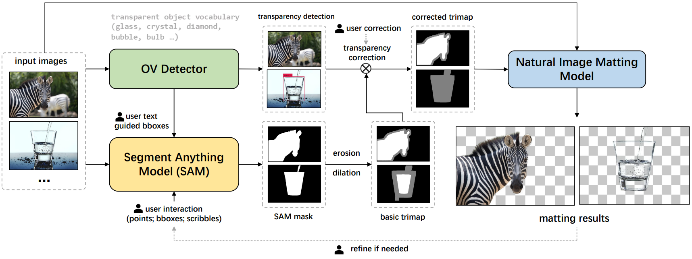
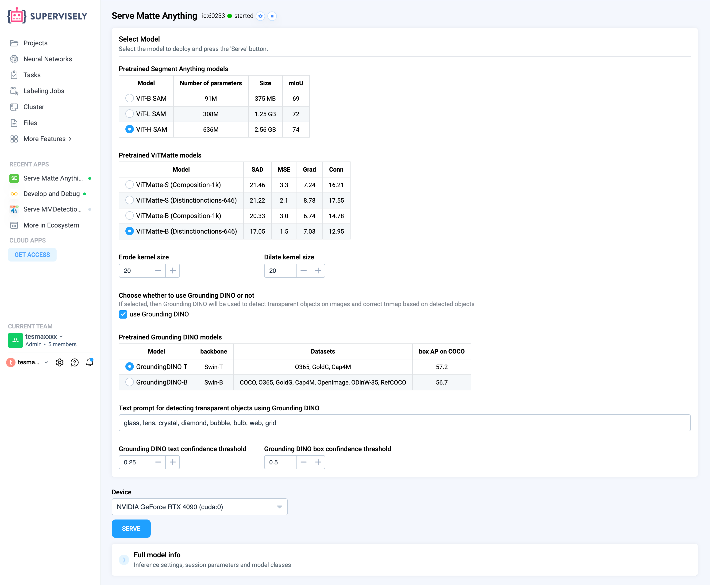
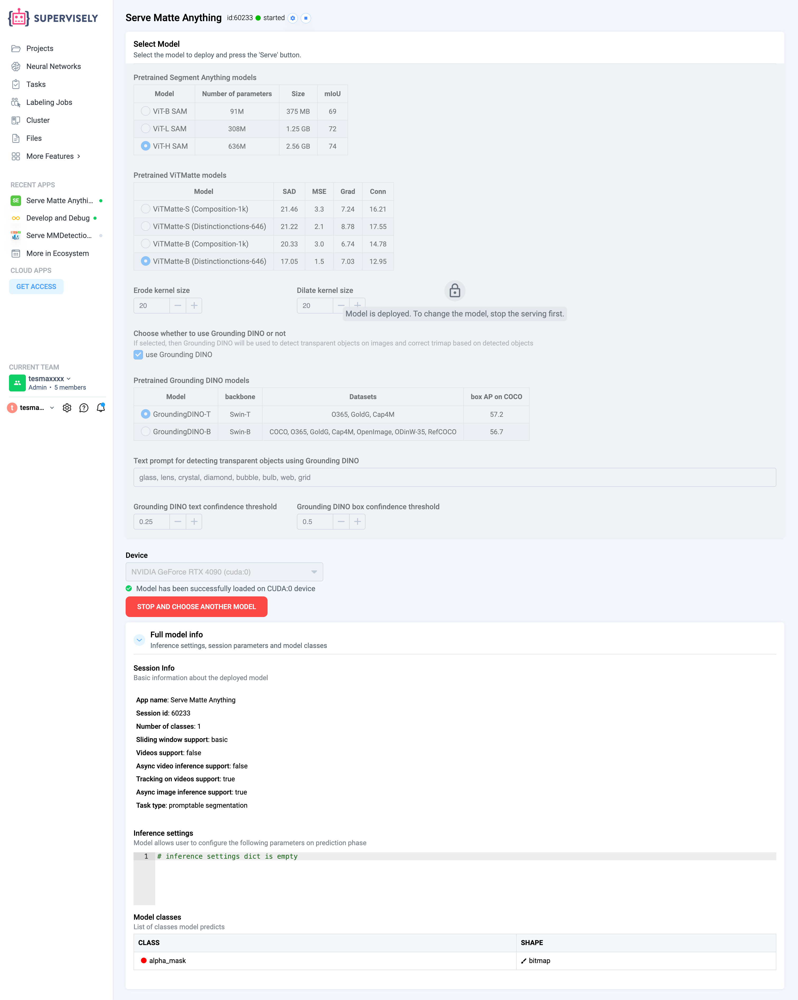

  
  

# Serve Matte Anything

  <a href="#Overview">Overview</a> •
  <a href="#How-To-Run">How To Run</a> •
  <a href="#example-apply-matte-anything-to-image-in-labeling-tool">Example: apply Matte-Anything to image in labeling tool</a> •
  <a href="#Acknowledgment">Acknowledgment</a>

# Overview

Matte Anything, a combination of several machine learning models proposed by researchers from Huazhong University of Science and Technology, unites segmentation and matting models into a single pipeline to produce accurate alpha channels for images with high quality and simple user interaction.

Matte Anything firstly employs Segment Anything Model to generate a segmentation mask for target object on input image. Subsequently, open-vocabulary object detection model (GroudingDINO) is used to detect commonly occurring transparent objects. Trimaps are then generated based on the segmentation and transparent object detection results, which are subsequently passed into image matting model - ViTMatte.

# How To Run

**Step 1.** Select pretrained model architecture and press the **Serve** button

**Step 2.** Wait for the model to deploy

# Example: apply Matte-Anything to image in labeling tool

Open your images project, open project settings, go to Visuals, select image matting as project labeling interface:

https://private-user-images.githubusercontent.com/91027877/333764496-651ac146-61fc-4adc-88ce-0243da15dcf2.mp4

Select smart tool, create annotation class of shape 'Alpha mask' and draw a bounding box around target object on image (you can also adjust mask by adding positive and negative points if necessary):

https://private-user-images.githubusercontent.com/91027877/333764530-d25e7ce4-81d8-46cf-a6de-dce891bc0b38.mp4

# Acknowledgment

This app is based on the great work [Matte Anything](https://github.com/hustvl/Matte-Anything).

